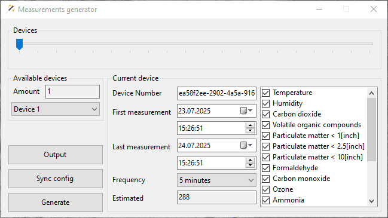
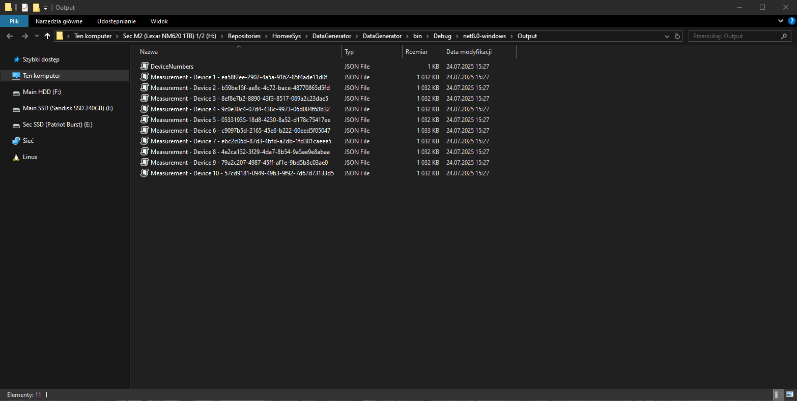

# DataGenerator

The **DataGenerator** application is a utility designed to generate realistic fake data for the **Measurements** service of the **Homee System Server**.

It provides a simple **WinForms-based UI** where users can:

- Choose between 1 and 20 devices.
- Configure each device individually or synchronize settings across all devices.
- Assign custom device numbers.
- Define the date range for the first and last measurements.
- Set measurement frequency (e.g., every 5, 10, or 15 minutes).
- Select the types of measurements each device will perform.

The application generates multiple `.json` files:

- **DeviceNumber.json** – Used to register devices in the **Devices** service.
- **Other `.json` files** – Contain measurement data that can be easily imported into **CosmosDB** for testing or simulation purposes.

## Showcase


## Output


## DeviceNumbers

```json
[
  {
    "Name": "Device 1",
    "DeviceNumber": "ea58f2ee-2902-4a5a-9162-85f4ade11d0f"
  },
  {
    "Name": "Device 2",
    "DeviceNumber": "b59be15f-ae8c-4c72-bace-48770865d5fd"
  },
  {
    "Name": "Device 3",
    "DeviceNumber": "8ef8e7b2-8890-43f3-8517-069a2c23dae5"
  },
  {
    "Name": "Device 4",
    "DeviceNumber": "9c0e30c4-07d4-438c-9973-06d004f68b32"
  },
  {
    "Name": "Device 5",
    "DeviceNumber": "05331935-18d8-4230-8a52-d178c75417ee"
  },
  {
    "Name": "Device 6",
    "DeviceNumber": "c9097b5d-2165-45e6-b222-60eed5f05047"
  },
  {
    "Name": "Device 7",
    "DeviceNumber": "ebc2c06d-87d3-4bfd-a2db-1fd381caeee5"
  },
  {
    "Name": "Device 8",
    "DeviceNumber": "4e2ca132-3f29-4da7-8b54-9a5ae9e8abaa"
  },
  {
    "Name": "Device 9",
    "DeviceNumber": "79a2c207-4987-45ff-af1e-9bd5b3c03ae0"
  },
  {
    "Name": "Device 10",
    "DeviceNumber": "57cd9181-0949-49b3-9f92-7d67d73133d5"
  }
]
```

## Examplary output file

```json
[
  {
    "id": "98b7d080-845d-4146-a3a6-e4afd7667f39",
    "DeviceNumber": "ea58f2ee-2902-4a5a-9162-85f4ade11d0f",
    "RegisterDate": "2025-07-01T15:26:51",
    "Temperature": {
      "Value": 22.27650956340576,
      "Unit": "\u00B0C"
    },
    "Humidity": {
      "Value": 43.6753984134498,
      "Unit": "% RH"
    },
    "CO2": {
      "Value": 991.5635282027142,
      "Unit": "ppm"
    },
    "VOC": {
      "Value": 192.45865596176623,
      "Unit": "\u00B5g/m\u00B3"
    },
    "ParticulateMatter1": {
      "Value": 1.84637676834021,
      "Unit": "\u00B5g/m\u00B3"
    },
    "ParticulateMatter2v5": {
      "Value": 6.3400334078465885,
      "Unit": "\u00B5g/m\u00B3"
    },
    "ParticulateMatter10": {
      "Value": 20.745296672823255,
      "Unit": "\u00B5g/m\u00B3"
    },
    "Formaldehyde": {
      "Value": 0.025925723981450925,
      "Unit": "\u00B5g/m\u00B3"
    },
    "CO": {
      "Value": 1.2316348551835992,
      "Unit": "ppm"
    },
    "O3": {
      "Value": 12.29314714545239,
      "Unit": "ppb"
    },
    "Ammonia": {
      "Value": 0.12157181169472539,
      "Unit": "mg/m\u00B3"
    },
    "Airflow": {
      "Value": 87.38903010395094,
      "Unit": "CFM"
    },
    "AirIonizationLevel": {
      "Value": 30044.93278328529,
      "Unit": "ions/cm\u00B3"
    },
    "O2": {
      "Value": 20.798513774958973,
      "Unit": "%"
    },
    "Radon": {
      "Value": 32.501615748343895,
      "Unit": "Bq/m\u00B3"
    },
    "Illuminance": {
      "Value": 676.8561747377088,
      "Unit": "lux"
    },
    "SoundLevel": {
      "Value": 63.14788224210393,
      "Unit": "dB"
    }
  },
  {
    "id": "67f50e81-f539-4ecb-a1ed-11d8e1571c9c",
    "DeviceNumber": "ea58f2ee-2902-4a5a-9162-85f4ade11d0f",
    "RegisterDate": "2025-07-01T16:26:51",
    "Temperature": {
      "Value": 23.065282405956392,
      "Unit": "\u00B0C"
    },
    "Humidity": {
      "Value": 58.98023685311266,
      "Unit": "% RH"
    # more ...
```